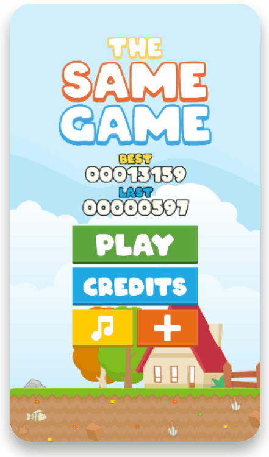

# The Same Game

**Made with <3 by [mateus.digital](https://mateus.digital).**

## Description:

<p align="center">
    
</p>

​The Same Game is a small matching making game created by mateus.digital.

This game was first created when I was in Minsk Belarus, during the pandemic in 2020 - I was feeling very homesick back then I tried to make something that remembered me my dear home, my mother and my dog.

For a long time it was forgotten in the shelve of projects, but in 2024 I decided to finish it and release!

I hope that you have fun!!

You can [play it online](https://mateus.digital/same_game)


<br>

As usual, you are **very welcomed** to **share** and **hack** it.


## Building


```powershell
git clone https://github.com/mateusdigital/same_game
cd same_game

./scripts/build-static.ps1 ## Builds the game.
./scripts/deploy.ps1       ## Deploys it to a server.
```

## Dependencies:

The project was created by using Pixi.js, but everything needed
is included on the project itself - so should be no external dependencies.

## Thanks to:

I used a lot of free and open resources, for which I'm most grateful!


## License:

This software is released under [GPLv3](https://www.gnu.org/licenses/gpl-3.0.en.html).


## Others:

- Email: hello@mateus.digital
- Website: https://mateus.digital
- Itch.io: https://mateusdigital.itch.io
- Linkedin: https://www.linkedin.com/in/mateusdigital
- Twitter: https://www.twitter.com/_mateusdigital
- Youtube: https://www.youtube.com/@_mateusdigital

There's more FLOSS things at [mateus.digital](https://mateus.digital) :)
